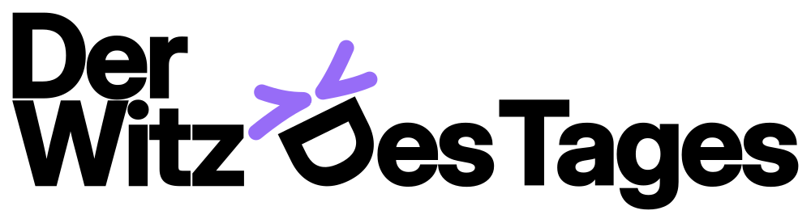
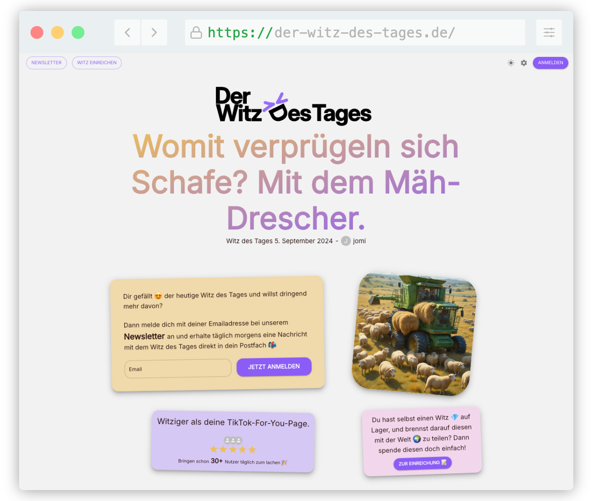
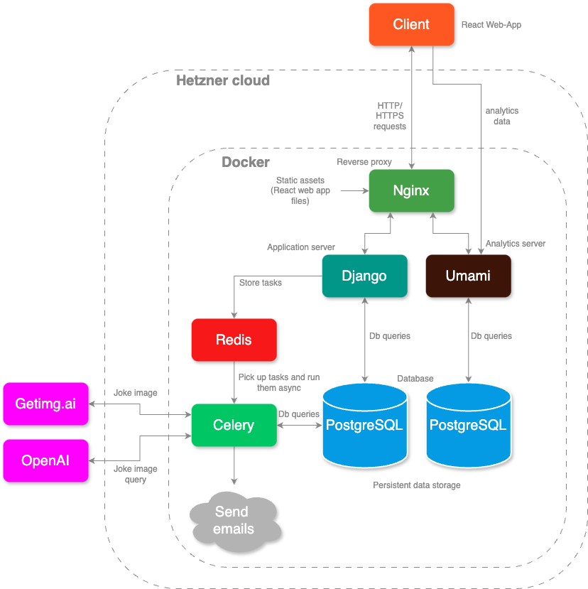

# der-witz-des-tag.de
Website link: [https://www.der-witz-des-tages.de](https://www.der-witz-des-tages.de)

## Description
"der-witz-des-tages" is a fun web-app in the german language that mainly delivers a daily joke per mail like a newsletter.

The website shows the daily selected joke together with a matching ai-generated image. It also allows visitors to subscribe to the daily newsletter. Visitors can also create an account and submit their own jokes to be featured.

## Table of Contents
1. [Description](#description)
2. [Website-preview](#website-preview)
3. [Features](#features)
4. [Architecture](#architecture)

## Website-preview

*Figure 1: Preview of the website landing page of https://www.der-witz-des-tages.de with the daily featured joke and matching image*

## Features
- Daily joke with matching ai-generated picture
- Subscribe and recieve daily joke newsletter
- Create user account and submit own jokes
- Responsive design

## Architecture

*Figure 2: Software architecture of the project*

The application follows a modern web development architecture:

- **Frontend**: The frontend is a React-based web application where users can interact with the platform. The client communicates with the backend via HTTP/HTTPS requests. It allows visitors to view the daily joke and subscribe to the newsletter. Togehter with the authentication services visitors can create an account and submit their own jokes.
- **Backend**:
    - Django: Django/wsgi-server serves as the main backend application server that handles business logic and API requests. It interacts with PostgreSQL to query the database and Redis to store tasks for asynchronous execution.
    - Redis: Redis is used as a message broker for task queuing in Celery. It stores tasks like sending emails asynchronously.
    - Celery: Celery handles asynchronous task execution. Tasks like sending daily email newsletters are picked up from Redis and executed by Celery workers.
- **Database**:
    - There are two PostgreSQL databases:
        - Main Database: Interacts with Django and Celery for storing and retrieving jokes, user information, and other persistent data.
        - Analytics Database: Used by Umami for tracking and storing analytics data, such as visitor behavior or subscription rates.
- **Deployment**: 
    - Hetzner Cloud: The entire application is hosted on Hetzner Cloud, a hosting service.
    - Nginx: Acts as a reverse proxy server that routes traffic between the client and backend services. It serves static assets, such as React web app files, to the client. Nginx also handles traffic to API endpoints analytics endpoints.
    - Docker: All backend services are containerized using Docker, allowing for easy deployment and orchestration of different components like Django, Redis, Celery, Nginx, PostgreSQL, and Umami.
